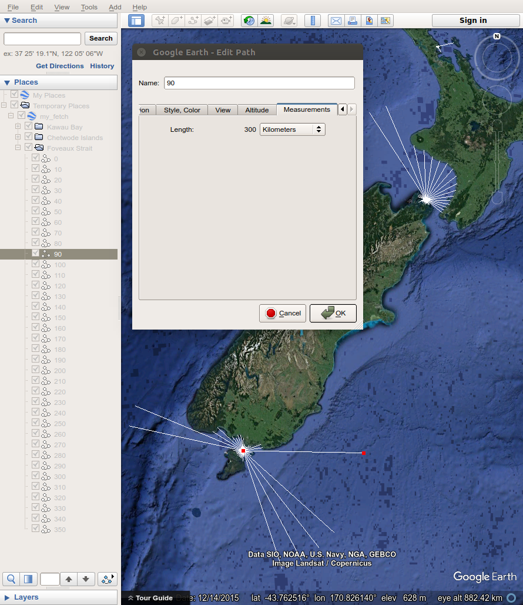

# Calculate average fetch for any coastal area around New Zealand

[](https://travis-ci.org/blasee/fetchR)

This package was designed to provide an objective measurement of fetch for any
coastal location around New Zealand. Calculating fetch by hand is inaccurate,
time-consuming and unreliable. The **fetchR** package provides a single function
to calculate the average fetch, all that is required is the latitude and 
longitude of the location in decimal degrees.

# Web application

Check out the online application for **fetchR** at https://blasee.shinyapps.io/fetchR_shiny/!

# Local installation

The installation of **fetchR** requires the `rgeos` package successfully installed.

## From R

The following assumes you have an internet connection from R without any 
firewall/proxy/permission issues.

```r
install.packages("devtools")
library(devtools)
install_github("blasee/fetchR")
```

# Calculate average fetch

To calculate the average fetch for the marine site at latitude = -36.4 and 
longitude = 174.8:


```r
library(fetchR)
kawau_bay = fetch(-36.4, 174.8)
```

```
## Projecting location onto NZTM 2000 map projection
## checking coordinate is not on land
## calculating fetch
```

```r
# Contains the distances for each direction (the first 6 rows are shown below)
kawau_bay
```

```
   latitude longitude direction fetch
1 -36.39953  174.8306        90  2.74
2 -36.40347  174.8273       100  2.48
3 -36.40688  174.8248       110  2.35
4 -36.41251  174.8280       120  2.87
5 -36.41348  174.8206       130  2.38
6 -36.41755  174.8189       140  2.58
...
```

The summary function gives the location coordinates, average and median fetch
and summarises the average fetch length from the four compass quadrants.

```r
summary(kawau_bay)
```

```
Latitude:  -36.4
Longitude: 174.8
Average:   4.96km
Median:    2.86km

Average northerly fetch [315, 45):  2.3km
Average easterly fetch [45, 135):   6.1km
Average southerly fetch [135, 225): 6.7km
Average westerly fetch [225, 315):  4.8km

n_bearings = 9
```

# Plotting methods
Plotting the resulting vectors is easy with the default plot method.

```r
plot(kawau_bay)
```


## Output to KML
Many GIS applications involve KML files for collaboration, interaction and 
editing. The vectors in each direction can be exported to KML files using the 
`kml` function in the `plotKML` package.

```r
# Install and load plotKML library
if (!require(plotKML))
  install.packages("plotKML")
  
library(plotKML)

Create some labels indicating the fetch vector directions
labs = sapply(slot(kawau_bay, "lines"), slot, "ID")

# Save 'kawau_bay.kml' to the current directory
kml(kawau_bay, labels = labs)
```



CC-By Land Information New Zealand. This product uses data sourced from Landcare Research under CC-BY, http://creativecommons.org/licenses/by/3.0/nz/